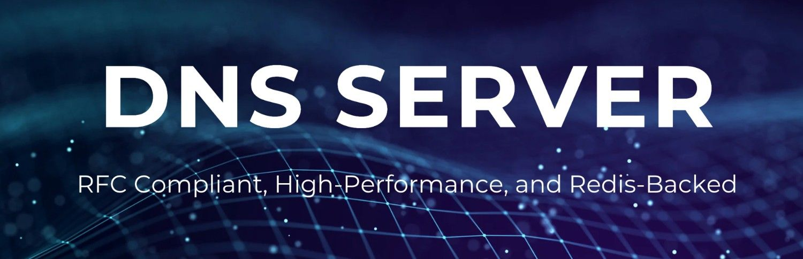
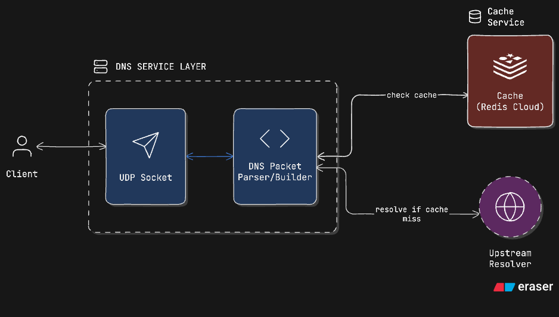
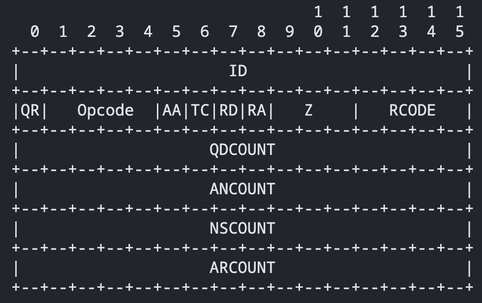
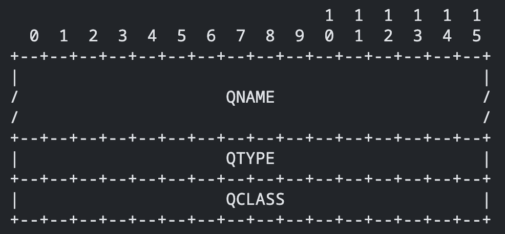
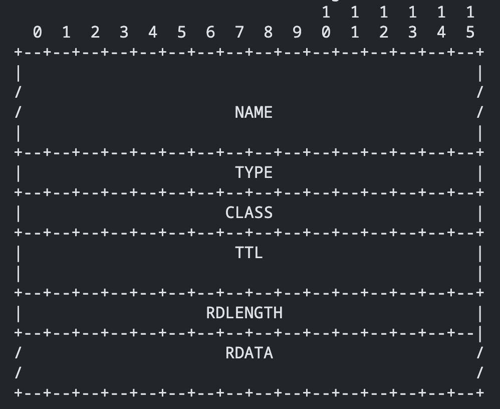
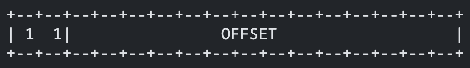

## 🚀 Executive Summary

This project is a **fully RFC 1035-compliant DNS server** written in TypeScript, designed for high performance, extensibility, and real-world deployment. It features:

- **Raw DNS packet parsing and construction** (header, question, answer, compression)
- **Domain name compression** as per RFC 1035
- **Multi-question support** in a single DNS query
- **Redis Cloud integration** for ultra-fast DNS caching
- **Production-ready Docker setup**

This project is built with protocol-level implementation, robust handling of DNS edge cases, and a modular, extensible codebase suitable for advanced DNS features and future RFCs.

---

## ✨ Features

- **Full DNS packet parsing and building** (header, question, answer, compression)
- **RFC 1035-compliant**: All fields, flags, and structures
- **Domain name compression** (pointer-based, with circular reference protection)
- **Multi-question query support**
- **Redis Cloud caching** for performance
- **Configurable upstream resolver** (e.g., 1.1.1.1, 8.8.8.8)
- **Dockerized for easy deployment**

---

## 🏗️ Architecture Overview


_DNS Server Architecture_

- **app/main.ts**: Entry point, UDP server, query handler
- **lib/utils/**: Core DNS parsing/building utilities
- **classes/**: RFC-compliant DNS header, question, and answer classes
- **lib/redis/**: Redis Cloud client

---

## 📦 DNS Packet Parsing & RFC Compliance

### DNS Packet Structure (RFC 1035)

A DNS message consists of:

- **Header** (12 bytes):
  - ID, Flags (QR, Opcode, AA, TC, RD, RA, Z, RCODE), QDCOUNT, ANCOUNT, NSCOUNT, ARCOUNT)
    
- **Question Section**: One or more questions (domain name, type, class)
  - 
- **Answer Section**: Resource records (name, type, class, TTL, RDLENGTH, RDATA)
  - 
- **Message Compression**: The pointer takes the form of a two octet sequence
  - 

> 💡 Tip: For a detailed explanation of DNS Message Format, see [RFC 1035 Section 4.1](https://datatracker.ietf.org/doc/html/rfc1035#section-4.1).

#### Header Example (see `classes/headers.class.ts`):

```typescript
/**
 * Implements a class for handling DNS message headers according to RFC 1035.
 * Manages the 12-byte DNS header structure with support for all standard header fields.
 */
class DNSHeader {
  // ...
  writeHeader(data: DNSHeaderType): void {
    const flags = (data.qr << 15) | (data.opcode << 11) | ...;
    this.headerBuffer.set([data.pid, flags, data.qdcount, ...]);
  }
  getHeaderBuffer(): Buffer { /* ... */ }
}
```

#### Question & Answer Example (see `classes/questions.class.ts`, `classes/answers.class.ts`):

```typescript
class DNSQuestion {
	writeQuestion(question, nameMap, currentPosition) {
		/* ... */
	}
	getQuestionBuffer() {
		/* ... */
	}
}
class DNSAnswer {
	writeAnswer(data, nameMap, currentOffset) {
		/* ... */
	}
	getAnswerBuffer() {
		/* ... */
	}
}
```

#### Domain Name Compression (RFC 1035 §4.1.4)

- Uses pointers to avoid repeating domain names
- Prevents circular references and invalid pointers
- See `lib/utils/common.utils.ts` for `encodeDomainName` and `parseDomainNameFromBuffer`

#### Parsing & Building Packets

- **parseDNSHeader**: Extracts all header fields from a buffer
- **parseDNSQuestion**: Parses questions with compression support
- **parseDNSAnswer**: Parses answers, supports all record types (A, CNAME, MX, etc.)
- **mergeResponses**: Merges multiple responses into a single DNS message

---

## ☁️ Redis Cloud Integration

- **lib/redis/client.redis.ts** connects to Redis Cloud using environment variables
- Used for caching DNS responses for ultra-fast lookups
- Configure your Redis Cloud credentials in `.env` (see below)

---

## 🛠️ Getting Started

### Prerequisites

- Docker (for containerized deployment)
- (Optional) Node.js and Bun if you want to run locally without Docker

### Environment Setup

You must provide your environment variables for the DNS server. There are two ways to do this:

1. **Edit the `environment` section in `docker-compose.yml`:**

   - Open `docker-compose.yml` and enter your values under the `environment:` key for the `dns_server` service.
   - Example:
     ```yaml
     environment:
       HOST_NAME: "127.0.0.1"
       PORT: 2053
       RESOLVER: "8.8.8.8:53"
       REDIS_PORT: your_redis_port
       REDIS_HOST: your_redis_host
       REDIS_PASSWORD: your_redis_password
       REDIS_USERNAME: your_redis_username
     ```

2. **Or, use a `.env` file:**
   - Copy `.env_example` to `.env` and fill in your values.
   - Make sure your `docker-compose.yml` references the `.env` file if you use this method.

### Build & Run (Recommended: Docker Compose)

Start the DNS server using Docker Compose:

```sh
docker-compose up --build
```

This will build the image and start the DNS server on UDP port 2053, using your `.env` configuration.

---

## 🧪 Usage

- Send DNS queries to `HOST_NAME:PORT` (default: 127.0.0.1:2053)
- Change upstream resolver via `RESOLVER` env in `.env`
- Responses are RFC-compliant and support multi-question queries

### Example dig Command

To test your DNS server, use:

```sh
dig @127.0.0.1 -p 2053 example.com
```

This will query your local DNS server for `example.com` on port 2053.

---

## 📁 File/Directory Structure

```
app/main.ts                # Entry point, UDP server
lib/utils/                 # DNS parsing/building utilities
classes/                   # RFC-compliant DNS classes
lib/redis/                 # Redis Cloud client
.env_example               # Example environment variables
Dockerfile, docker-compose.yml
```

---

## 🛣️ Extensibility & RFC Roadmap

- **Add new record types**: Extend `DNSAnswer` and parsing logic
- **Advanced RFCs**: Easily add support for DNSSEC, EDNS(0), etc.
- **Performance**: Swap out cache, add metrics, or scale horizontally

---

## 💡 Technical Highlights

- Protocol-level DNS implementation from the ground up
- Strict adherence to RFC 1035, including all fields, flags, and compression
- Production-oriented: Redis Cloud integration, Docker support, modular architecture
- Extensible design for new features, RFCs, or record types

---

## 📜 License

MIT
